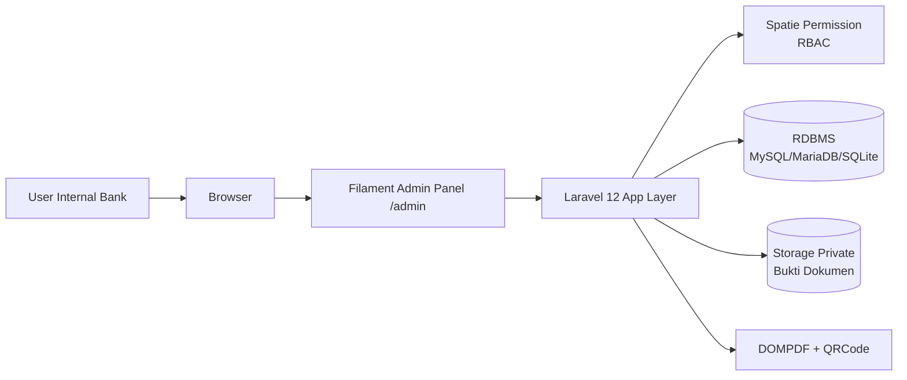
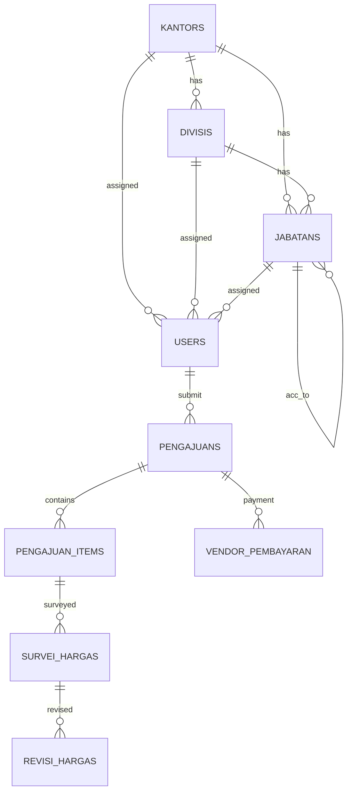

# Dokumen Pengembangan Aplikasi Web App Internal Bank
## PT BPRS HIK MCI

> Dokumen ini disusun berdasarkan struktur kode pada repository aplikasi E-Procurement internal (Laravel + Filament), dan ditujukan sebagai dokumen teknis-operasional untuk kebutuhan audit, tata kelola TI, dan pengembangan lanjutan.

---

## A. Informasi Dasar Aplikasi

### 1) Nama aplikasi
**E-Procurement Internal PT BPRS HIK MCI**.

### 2) Unit/divisi pemilik
Aplikasi mendukung proses lintas fungsi dengan keterlibatan:
- Divisi Pemohon (Staff/Team Leader)
- Manager
- Kepala Divisi
- Kepala Divisi IT
- General Affairs (GA)
- Tim Budgeting
- Kepala Divisi GA
- Direktur Operasional
- Direktur Utama
- Kepala Divisi Operasional
- Super Admin (pengelola sistem)

### 3) Tahun mulai digunakan
Indikasi awal pengembangan dan inisialisasi skema data dimulai **tahun 2025** (berdasarkan migration awal master data dan proses pengajuan).

### 4) Status aplikasi
**Aktif (ongoing development / enhancement)**.

### 5) Deskripsi singkat fungsi bisnis
Aplikasi mengelola proses pengadaan internal dari awal hingga akhir, meliputi:
- pembuatan pengajuan kebutuhan barang/jasa/sewa,
- approval berjenjang sesuai struktur organisasi,
- rekomendasi IT (untuk kebutuhan IT),
- survei harga dan pemilihan vendor,
- kontrol budget,
- pencairan dana (DP/pelunasan),
- serta jejak proses revisi harga dan penyelesaian.

### 6) Jenis pengguna & role yang terlibat
| Kelompok Pengguna | Role Sistem | Fungsi Utama |
|---|---|---|
| Pemohon | Staff / Team Leader | Membuat pengajuan |
| Atasan 1 | Manager | Approval level manager |
| Atasan 2 | Kepala Divisi | Approval level kepala divisi |
| Reviewer teknis | Kepala Divisi IT | Rekomendasi IT |
| Surveyor | General Affairs | Survei harga & kelengkapan vendor |
| Reviewer budget | Tim Budgeting | Approval budget |
| Finalisasi GA | Kepala Divisi GA | Finalisasi keputusan jalur GA |
| Direksi | Direktur Operasional / Direktur Utama | Persetujuan level direksi |
| Operasional | Kepala Divisi Operasional | Validasi/persetujuan operasional tertentu |
| Administrator | Super Admin | Kelola master data, user, seluruh akses |

---

## B. Tujuan & Proses Bisnis

### 1) Permasalahan yang diselesaikan aplikasi
- Proses pengajuan dan approval manual sulit dilacak.
- Risiko keterlambatan akibat alur persetujuan tidak terstandarisasi.
- Sulit melakukan audit trail siapa menyetujui/menolak dan kapan.
- Sulit memonitor dampak revisi harga terhadap budget.

### 2) Alur proses bisnis yang didukung
**Alur normal (high-level):**
1. Pemohon membuat pengajuan.
2. Approval Manager.
3. Approval Kepala Divisi.
4. Jika item IT → rekomendasi IT.
5. Survei harga oleh GA.
6. Persetujuan Budgeting.
7. Persetujuan Kadiv GA.
8. Persetujuan Direktur Operasional.
9. Persetujuan Direktur Utama.
10. Pencairan dana (DP/pelunasan) dan penyelesaian.

**Alur revisi:**
- Saat terjadi perubahan harga/vendor/tax impact, sistem memproses siklus revisi dengan approval ulang sesuai tahap yang berlaku.

### 3) Perubahan proses sebelum vs sesudah aplikasi
| Aspek | Sebelum (Manual) | Sesudah (Aplikasi) |
|---|---|---|
| Pencatatan pengajuan | Dokumen/komunikasi terpisah | Terpusat per `kode_pengajuan` |
| Approval | Sulit ditelusuri | Bertahap, terstruktur, berbasis status |
| Bukti dokumen | Tersebar | Tersimpan dan diakses terproteksi |
| Monitoring | Reaktif | Real-time via halaman status/dashboard |
| Audit | Perlu rekonsiliasi manual | Jejak data lebih siap audit |

### 4) Dampak terhadap efisiensi / risiko operasional
- Waktu koordinasi approval berkurang karena alur terstandar.
- Transparansi meningkat untuk pemohon dan approver.
- Risiko keputusan tanpa data harga berkurang.
- Risiko operasional menurun karena status dan bukti terdokumentasi.

---

## C. Arsitektur & Teknologi

### 1) Diagram arsitektur sistem

### 2) Bahasa pemrograman & framework
- **PHP 8.2**
- **Laravel 12**
- **Filament 3** (admin panel)
- **Vite + Tailwind CSS** (asset frontend)

### 3) Database yang digunakan
- Konfigurasi aplikasi mendukung: SQLite, MySQL, MariaDB, PostgreSQL, SQL Server.
- Pola implementasi proses dan relasi tabel menunjukkan orientasi kuat ke RDBMS transaksi (umumnya MySQL/MariaDB pada lingkungan internal).

### 4) Server/hosting & lingkungan sistem
- Aplikasi berbasis web internal.
- Panel utama berada pada path **`/admin`**.
- Mendukung mode development melalui command composer dev (serve, queue listener, logs, vite).

### 5) Integrasi dengan sistem lain / API
- Spatie Laravel Permission (RBAC).
- DOMPDF untuk dokumen PDF.
- Simple QRCode untuk kebutuhan verifikasi/label.
- Route verifikasi approval bertanda tangan URL (signed route).
- Route akses file private dengan proteksi autentikasi.

---

## D. Fitur & Hak Akses

### 1) Daftar modul/fitur utama
1. Dashboard & widget ringkasan.
2. Master Data (Kantor, Divisi, Jabatan, User).
3. Buat Pengajuan.
4. Status Pengajuan Saya.
5. Persetujuan Manager.
6. Persetujuan Kepala Divisi.
7. Rekomendasi IT.
8. Survei Harga GA.
9. Persetujuan Budgeting.
10. Persetujuan Kadiv GA.
11. Persetujuan Direktur Operasional.
12. Persetujuan Direktur Utama.
13. Persetujuan Kadiv Operasional.
14. Pencairan Dana Operasional.
15. Revisi Harga & validasi revisi.

### 2) Fungsi tiap modul
| Modul | Fungsi |
|---|---|
| Buat Pengajuan | Input item, kuantitas, spesifikasi, justifikasi, generate kode pengajuan |
| Persetujuan | Menilai, menyetujui/menolak, memberi catatan keputusan |
| Rekomendasi IT | Validasi kebutuhan item IT |
| Survei Harga GA | Input vendor, harga, pajak, bukti survei, pemilihan final |
| Budgeting | Menilai kecukupan/alokasi budget |
| Pencairan Dana | Kelola data rekening vendor, DP, pelunasan, bukti pembayaran |
| Status Pengajuan Saya | Monitoring progres oleh pemohon |

### 3) Role user & kewenangan akses
- **Staff/Team Leader:** buat pengajuan.
- **Manager:** approval manager.
- **Kepala Divisi:** approval kepala divisi.
- **Kepala Divisi IT:** rekomendasi IT.
- **General Affairs:** survei harga.
- **Tim Budgeting:** approval budget + pencairan dana operasional.
- **Kepala Divisi GA:** finalisasi keputusan GA.
- **Direktur Operasional:** approval level direksi operasional.
- **Direktur Utama:** approval final direksi utama.
- **Kepala Divisi Operasional:** persetujuan/validasi operasional terkait.
- **Super Admin:** akses penuh.

### 4) Alur persetujuan (approval flow)
Sistem menerapkan status proses berjenjang, termasuk:
- status menunggu approval per role,
- status ditolak per level,
- status revisi budget/approval revisi,
- status pencairan dana,
- status selesai.

---

## E. Struktur Data & Database

### 1) ERD atau relasi tabel

### 2) Daftar tabel penting
- Master: `kantors`, `divisis`, `jabatans`, `users`.
- Proses: `pengajuans`, `pengajuan_items`, `survei_hargas`, `revisi_hargas`, `vendor_pembayaran`.
- Keamanan akses: `roles`, `permissions`, `model_has_roles`, `model_has_permissions`, `role_has_permissions`.
- Session: `sessions`.

### 3) Jenis data sensitif yang disimpan
- NIK user.
- Password user (hashed).
- Data rekening vendor (nama/no rekening, bank).
- Data pajak (NPWP/NIK, nama pemilik, nominal).
- Dokumen bukti survei/pembayaran/penyelesaian.

### 4) Mekanisme validasi & integritas data
- Foreign key antartabel untuk menjaga konsistensi relasional.
- Unique key untuk identitas penting (contoh: NIK, kode pengajuan).
- Cast tipe data model untuk format field tertentu.
- Workflow status untuk mencegah lompatan proses yang tidak valid.

---

## F. Keamanan Sistem

### 1) Metode autentikasi & otorisasi
- Login menggunakan **NIK + password**.
- Otorisasi menggunakan **Role-Based Access Control** (Spatie Permission).
- Halaman proses dibatasi melalui validasi role per modul.

### 2) Enkripsi password/data
- Password di-hash menggunakan mekanisme hash Laravel.
- Dokumen sensitif ditempatkan di storage private.

### 3) Pengaturan session & timeout
- Session disiapkan melalui mekanisme session Laravel (termasuk tabel session database).
- Timeout/session lifetime mengikuti konfigurasi environment (`SESSION_LIFETIME`).

### 4) Logging aktivitas user
- Logging aplikasi melalui kanal logging Laravel.
- Data proses approval/review tersimpan sebagai jejak perubahan status dan metadata approval.

### 5) Pembatasan akses jaringan
- Route file private dilindungi autentikasi.
- Route verifikasi approval menggunakan signed URL untuk memitigasi manipulasi URL.
- Direkomendasikan hanya dapat diakses dari jaringan internal/VPN bank.

### 6) Mekanisme backup & recovery
**Rekomendasi operasional minimum:**
- Backup database harian.
- Backup storage private harian/mingguan.
- Enkripsi backup at-rest.
- Simpan salinan offsite.
- Uji restore berkala (bulanan/kuartalan).

---

## G. Infrastruktur & Deployment

### 1) Lokasi & spesifikasi server
Belum terdokumentasi eksplisit pada repository; perlu dilengkapi oleh tim infrastruktur (CPU/RAM/storage/DR location).

### 2) OS, web server, dan dependensi
- OS: Linux Server (rekomendasi).
- Web server: Nginx/Apache.
- Runtime: PHP 8.2 + ekstensi yang dibutuhkan Laravel.
- DB Server: MySQL/MariaDB (umum), atau sesuai kebijakan TI bank.

### 3) Domain/akses internal
- Domain internal tidak didefinisikan di repository.
- Endpoint panel admin: `/admin`.

### 4) Prosedur deployment/update aplikasi
1. Pull code terbaru.
2. Install dependency backend: `composer install --no-dev --optimize-autoloader`.
3. Jalankan migrasi: `php artisan migrate --force`.
4. Build frontend: `npm ci && npm run build`.
5. Optimasi cache: `php artisan optimize`.
6. Restart service web, PHP-FPM, queue worker.
7. Smoke test login + modul approval utama.

### 5) Jadwal & metode backup
- Daily incremental backup.
- Weekly full backup.
- Retensi minimum 30–90 hari (sesuai kebijakan bank).
- Simulasi restore terjadwal dengan checklist formal.

---

## H. Panduan Operasional

### 1) Cara login & penggunaan dasar
1. Akses URL internal aplikasi.
2. Buka `/admin`.
3. Login dengan NIK dan password.
4. Pilih menu sesuai role.

### 2) Proses operasional harian
- User membuat pengajuan baru.
- Approver memproses antrian sesuai role.
- Tim GA/Budgeting/Ops melanjutkan tahap masing-masing.
- Pemohon monitor status hingga selesai.

### 3) Cara generate laporan
- Gunakan template dokumen internal yang tersedia di layer view dokumen.
- Rekomendasi pengembangan: tambah menu laporan periodik (pengeluaran, SLA approval, performa vendor).

### 4) Penanganan error umum
| Gejala | Kemungkinan Penyebab | Tindakan |
|---|---|---|
| Gagal login | NIK/password salah, user tidak aktif | Verifikasi akun dan reset password |
| Akses menu ditolak | Role belum sesuai | Evaluasi role-permission user |
| Dokumen tidak bisa diakses | Belum login / file tidak ada | Cek autentikasi & keberadaan file |
| Proses approval mandek | Status belum sesuai tahap | Telaah status pengajuan dan data terkait |

---

## I. Riwayat Perubahan (Change Log)

> Ringkasan berbasis evolusi migration dan modul proses.

| Versi/Periode | Tanggal Perubahan | Ringkasan Perubahan | PIC/Developer |
|---|---|---|---|
| v0.1 (inisial) | 2025-06 | Inisialisasi master data, user, role-permission, pengajuan dasar | Tim Dev Internal |
| v0.2 | 2025-06 s.d. 2025-07 | Penambahan approval metadata, status budget, opsi pembayaran, data survei harga | Tim Dev Internal |
| v0.3 | 2025-07 | Penambahan tabel revisi harga dan alur revisi | Tim Dev Internal |
| v0.4 | 2025-08 | Penambahan modul pembayaran vendor (DP/pelunasan), bukti pajak/penyelesaian, timestamp approval lanjutan | Tim Dev Internal |
| v0.5 | 2025-09 | Penambahan keputusan Kadiv Operasional pada pengajuan | Tim Dev Internal |

---

## J. Risiko & Pengembangan Lanjutan

### 1) Keterbatasan sistem saat ini
- Informasi infrastruktur produksi belum terdokumentasi lengkap di repository.
- Belum ada matriks SLA formal di dalam aplikasi.
- Belum terlihat dokumentasi UAT/regression test terstruktur.

### 2) Potensi risiko keamanan/operasional
- Salah mapping role dapat menyebabkan akses tidak sesuai.
- Kegagalan backup/restore dapat berdampak ke kontinuitas proses.
- Pertumbuhan file bukti tanpa retensi dapat mengganggu performa storage.

### 3) Ketergantungan teknologi tertentu
- Ketergantungan tinggi pada Laravel, Filament, Spatie Permission, dan desain workflow custom.

### 4) Rencana pengembangan atau upgrade
1. Implementasi audit trail granular (before/after value).
2. Dashboard KPI eksekutif (SLA approval, tren biaya, deviasi budget).
3. Integrasi notifikasi multi-channel (email gateway/internal messaging).
4. Hardening keamanan (MFA, IP whitelist internal, secret management).
5. CI/CD + quality gate (unit test, static analysis, security scan).
6. Penyusunan BCP/DRP dan simulasi pemulihan berkala.

---

## Lampiran (Opsional untuk tim internal)

### A. Matriks Role vs Modul (Template)
| Modul | Staff | Manager | Kadiv | IT | GA | Budget | Kadiv GA | Dir Ops | Dir Utama | Kadiv Ops | Super Admin |
|---|---|---|---|---|---|---|---|---|---|---|---|
| Buat Pengajuan | ✅ | ✅ | ✅ | ✅ | ❌ | ❌ | ✅ | ✅ | ✅ | ✅ | ✅ |
| Approval Manager | ❌ | ✅ | ❌ | ❌ | ❌ | ❌ | ❌ | ❌ | ❌ | ❌ | ✅ |
| Approval Kadiv | ❌ | ❌ | ✅ | ✅ | ❌ | ❌ | ✅ | ❌ | ❌ | ❌ | ✅ |
| Rekomendasi IT | ❌ | ❌ | ❌ | ✅ | ❌ | ❌ | ❌ | ❌ | ❌ | ❌ | ✅ |
| Survei Harga | ❌ | ❌ | ❌ | ❌ | ✅ | ❌ | ❌ | ❌ | ❌ | ❌ | ✅ |
| Approval Budget | ❌ | ❌ | ❌ | ❌ | ❌ | ✅ | ❌ | ❌ | ❌ | ❌ | ✅ |
| Persetujuan Direksi | ❌ | ❌ | ❌ | ❌ | ❌ | ❌ | ❌ | ✅ | ✅ | ❌ | ✅ |
| Pencairan Dana | ❌ | ❌ | ❌ | ❌ | ❌ | ✅ | ❌ | ❌ | ❌ | ❌ | ✅ |

### B. Checklist Readiness Audit (Template)
- [ ] SOP user provisioning/deprovisioning tersedia.
- [ ] Kebijakan password dan timeout ditetapkan.
- [ ] Backup & restore test terdokumentasi.
- [ ] Log review periodik dilakukan.
- [ ] Perubahan produksi melalui change approval.
