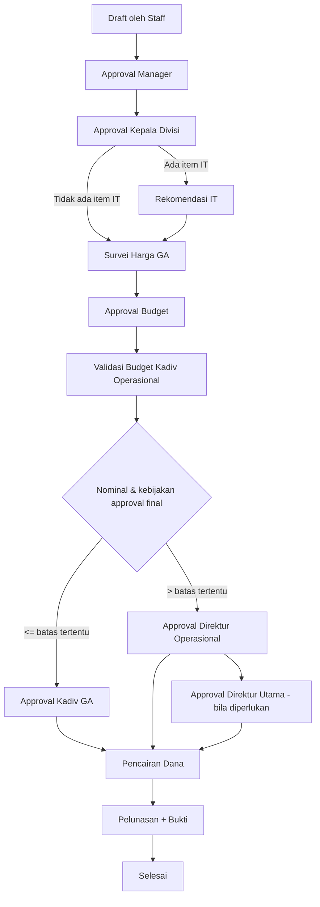
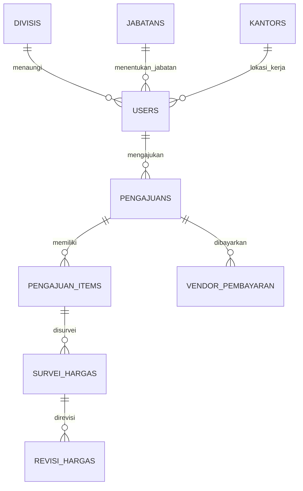
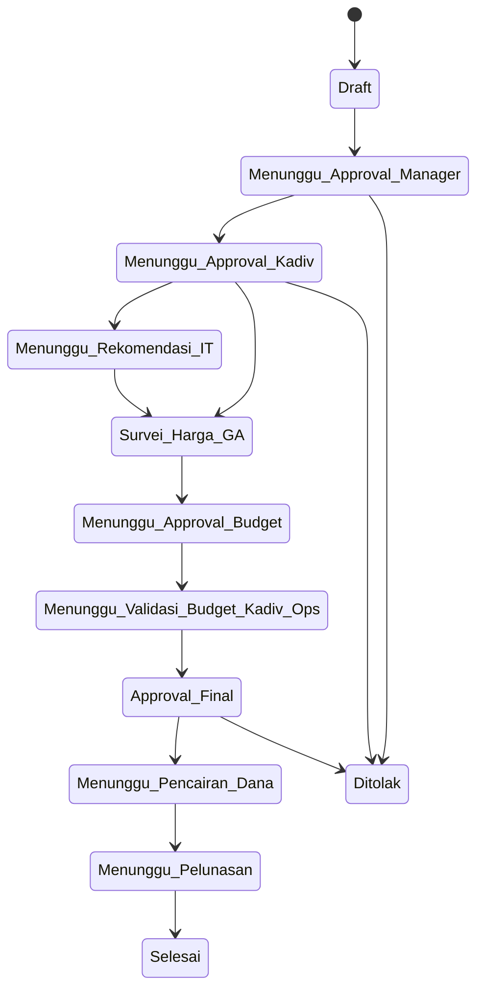

# Dokumen Pengembangan Aplikasi Web App Internal Bank PT BPRS HIK MCI

**Nama Sistem:** BPRS Procurement System (Web App Internal Pengadaan)  
**Organisasi:** PT BPRS HIK MCI  
**Versi Dokumen:** 1.0  
**Tanggal Dokumen:** 2026-02-17  
**Basis Analisis:** Struktur kode, konfigurasi aplikasi, skema database, dan metadata repository.

---

## A. Informasi Dasar Aplikasi

| Komponen | Detail |
|---|---|
| Nama aplikasi | **BPRS Procurement System** |
| Unit/divisi pemilik | **Divisi Operasional & General Affairs (GA)** dengan keterlibatan IT, Budgeting, dan Direksi pada alur persetujuan |
| Tahun mulai digunakan | **2025 (indikasi dari artefak migration dan metadata proyek)** |
| Status aplikasi | **Aktif (ongoing development & maintenance)** |
| Deskripsi singkat fungsi bisnis | Sistem informasi pengadaan barang/jasa internal dengan alur pengajuan, approval bertingkat, survei harga vendor, validasi budget, hingga proses pencairan & pelunasan. |
| Jenis pengguna & role | Staff/Pemohon, Manager, Kepala Divisi, Kepala Divisi IT, GA, Kepala Divisi GA, Budgeting, Kepala Divisi Operasional, Direktur Operasional, Direktur Utama, Super Admin. |

---

## B. Tujuan & Proses Bisnis

### 1) Permasalahan yang diselesaikan aplikasi
- Proses pengadaan manual (chat/email/lembar kerja) sulit ditelusuri dan berisiko keterlambatan approval.
- Sulit melakukan audit trail pihak yang menyetujui/menolak, kapan persetujuan dilakukan, dan dasar keputusan.
- Potensi ketidakteraturan dokumen pendukung (bukti survei, bukti transfer, bukti pajak, bukti penyelesaian).
- Kebutuhan pemisahan kewenangan lintas unit (pemohon, atasan, budget, direksi).

### 2) Alur proses bisnis yang didukung
1. Staff membuat pengajuan (Draft).
2. Approval Manager.
3. Approval Kepala Divisi.
4. Jika item terkait IT: rekomendasi IT.
5. Survei harga oleh GA.
6. Validasi budget (tim budgeting dan validasi Kadiv Operasional).
7. Approval final sesuai nominal (Kadiv GA / Direktur Operasional / Direktur Utama).
8. Pencairan dana.
9. Pelunasan dan unggah bukti.
10. Selesai.

### 3) Sebelum vs sesudah aplikasi

| Aspek | Sebelum | Sesudah |
|---|---|---|
| Pengajuan | Manual dan tersebar | Form terstruktur terpusat |
| Approval | Tidak konsisten | Workflow status bertingkat |
| Monitoring | Sulit melihat bottleneck | Dashboard dan status pengajuan real-time |
| Dokumen bukti | Berisiko tercecer | Tersimpan sistematis per pengajuan |
| Audit | Sulit menyusun histori | Timestamp approval & data approver tersimpan |

### 4) Dampak efisiensi & risiko operasional
- **Efisiensi:** mempercepat siklus persetujuan dan pemantauan status.
- **Kontrol risiko:** pemisahan peran, jejak proses, dan pengendalian file privat mengurangi risiko fraud/proses tanpa otorisasi.
- **Kepatuhan internal:** setiap tahapan memiliki status eksplisit dan aktor penanggung jawab.

---

## C. Arsitektur & Teknologi

### 1) Diagram arsitektur sistem

```mermaid
flowchart LR
    U[User Internal Bank] --> B[Browser]
    B --> A[Laravel 12 + Filament Admin Panel]
    A --> DB[(MySQL)]
    A --> FS[(Storage File Bukti)]
    A --> PDF[DOMPDF Service]
    A --> QR[QR Code Generator]

    subgraph Integrasi Internal
      API1[/Signed URL Verifikasi Approval/]
      API2[/Secure File Access (Auth)/]
    end

    A --> API1
    A --> API2
```

### 2) Bahasa pemrograman & framework
- **Backend:** PHP 8.2+.
- **Framework:** Laravel 12.
- **Admin/UI Framework:** Filament 3.3.
- **Frontend assets:** Vite + TailwindCSS.

### 3) Database
- **Utama:** MySQL 8.0+.
- ORM: Eloquent Model Laravel.

### 4) Server/hosting & lingkungan
- Runtime web server yang didukung: **Apache/Nginx**.
- Lingkungan standar Laravel: `.env`, artisan, migration, queue listener (opsional), log framework.

### 5) Integrasi dengan sistem lain/API
- Endpoint verifikasi approval berbasis **signed URL**.
- Endpoint akses file privat berbasis autentikasi.
- Internal endpoint Livewire/Filament untuk interaksi panel admin.

---

## D. Fitur & Hak Akses

### 1) Daftar modul/fitur utama
- Master Data (Divisi, Jabatan, Kantor, User).
- Pengajuan pengadaan.
- Approval berjenjang.
- Rekomendasi IT.
- Survei harga GA.
- Validasi budget & revisi harga.
- Pencairan dana dan pelunasan vendor.
- Dashboard monitoring (chart dan riwayat).

### 2) Fungsi tiap modul (ringkas)
| Modul | Fungsi |
|---|---|
| Pengajuan | Membuat dan mengelola permintaan pengadaan serta itemnya |
| Approval | Menyetujui/menolak sesuai role, nominal, dan kondisi proses |
| Survei Harga | Membandingkan vendor, unggah bukti penawaran, rincian pajak |
| Budgeting | Mengendalikan status ketersediaan/alokasi budget |
| Pembayaran | Mencatat DP, pelunasan, bukti transfer/pajak/penyelesaian |
| Dashboard | Menyajikan indikator operasional dan histori pengajuan |

### 3) Role user & kewenangan akses
- **Pemohon/Staff:** buat draft, edit draft, lihat pengajuan sendiri.
- **Manager/Kadiv:** approval tahap awal.
- **Kadiv IT:** rekomendasi teknis bila item IT.
- **GA:** survei harga vendor dan kelengkapan bukti.
- **Budgeting + Kadiv Ops:** review/validasi budget.
- **Kadiv GA / Direksi:** approval final sesuai nominal dan kebijakan.
- **Super Admin:** pengelolaan penuh konfigurasi/data.

### 4) Alur persetujuan (approval flow)



---

## E. Struktur Data & Database

### 1) ERD / relasi utama



### 2) Daftar tabel penting
- `users`, `roles`, `permissions`, `model_has_roles`, dst. (akses pengguna).
- `pengajuans` (entitas proses utama).
- `pengajuan_items` (item barang/jasa).
- `survei_hargas` (penawaran/vendor).
- `revisi_hargas` (tracking revisi nilai).
- `vendor_pembayaran` (realisasi pembayaran).
- master referensi: `divisis`, `jabatans`, `kantors`.
- `sessions` (session database).

### 3) Jenis data sensitif yang disimpan
- Kredensial user (password hash).
- Identitas pegawai (NIK, nama).
- Informasi rekening vendor (nama/no rekening, bank).
- Dokumen bukti transaksi/pajak/penawaran.
- Riwayat keputusan approval dan catatan penolakan.

### 4) Mekanisme validasi & integritas data
- Primary key/foreign key via migration dan relasi Eloquent.
- Unique identifier (contoh: kode pengajuan, NIK user).
- Status berbasis konstanta untuk menjaga konsistensi state machine.
- Cast data tertentu (contoh JSON bukti penyelesaian).
- Audit timestamp per tahap persetujuan.

---

## F. Keamanan Sistem

### 1) Metode autentikasi & otorisasi
- Autentikasi berbasis **session guard** Laravel (`web`).
- Otorisasi role-permission menggunakan **spatie/laravel-permission**.
- Admin panel dilindungi middleware autentikasi Filament.

### 2) Enkripsi password/data
- Password user menggunakan cast `hashed` (hash otomatis Laravel).
- Signed URL untuk endpoint verifikasi approval mengurangi risiko manipulasi URL.

### 3) Pengaturan session & timeout
- Driver session: database.
- Lifetime default: 120 menit (dapat dikonfigurasi via env).
- Session cookie dikelola oleh middleware Laravel.

### 4) Logging aktivitas user
- Logging aplikasi menggunakan kanal logging Laravel.
- Proses bisnis tertentu menggunakan event log/debug (mis. status badge logic).

### 5) Pembatasan akses jaringan
- Endpoint file privat mewajibkan login (`auth` middleware).
- Endpoint verifikasi publik dibatasi melalui signature URL.
- Rekomendasi: batasi akses jaringan ke domain internal/VPN bank.

### 6) Mekanisme backup & recovery
- Backup database terjadwal (harian + retensi).
- Backup storage dokumen bukti (incremental + full backup mingguan).
- Uji restore berkala di environment staging/disaster recovery.

---

## G. Infrastruktur & Deployment

### 1) Lokasi & spesifikasi server
**Rekomendasi operasional internal bank:**
- App server: 4 vCPU, 8–16 GB RAM, SSD.
- DB server terpisah: 4–8 vCPU, 16+ GB RAM, storage redundant.
- Network segment internal + akses VPN/whitelist.

### 2) OS, web server, dependensi
- Linux server (Ubuntu LTS/RHEL).
- Nginx/Apache + PHP 8.2 FPM.
- MySQL 8.
- Composer/NPM untuk build asset.

### 3) Domain/akses internal
- Domain/subdomain internal (contoh: `procurement.internal.bprshikmci.local`).
- TLS aktif (sertifikat internal/enterprise CA).

### 4) Prosedur deployment/update
1. Pull perubahan branch rilis.
2. `composer install --no-dev --optimize-autoloader`.
3. `php artisan migrate --force`.
4. `php artisan config:cache && php artisan route:cache && php artisan view:cache`.
5. Build asset frontend (`npm ci && npm run build`).
6. Restart service terkait (php-fpm/queue).
7. Verifikasi smoke test.

### 5) Jadwal & metode backup
- **Database:** backup harian otomatis, retensi min. 30 hari.
- **File upload:** incremental harian + full mingguan.
- **Offsite copy:** replikasi ke media/server DR.

---

## H. Panduan Operasional

### 1) Cara login & penggunaan dasar
1. Akses panel admin internal (`/admin`).
2. Login menggunakan akun internal (NIK + password).
3. Role menentukan menu dan aksi yang terlihat.

### 2) Proses operasional harian
- Staff membuat/memperbarui draft pengajuan.
- Atasan memproses approval sesuai antrean status.
- GA mengisi survei vendor dan melampirkan bukti.
- Budgeting/Kadiv Ops validasi budget.
- Final approver menyetujui/menolak.
- Tim operasional melakukan pencairan dan pelunasan.

### 3) Cara generate laporan
- Gunakan fitur ekspor/print dokumen pengajuan pada modul terkait.
- PDF dihasilkan melalui integrasi DOMPDF.
- Dashboard chart membantu monitoring volume dan tren pengeluaran.

### 4) Penanganan error umum
| Error | Penyebab Umum | Penanganan |
|---|---|---|
| Tidak bisa login | Kredensial/role tidak sesuai | Reset password, verifikasi role-permission |
| File bukti tidak bisa diakses | Belum login/izin kurang | Pastikan sesi login aktif & hak akses benar |
| Pengajuan stuck di status tertentu | Tahap approval belum diproses | Identifikasi approver yang pending via dashboard |
| Gagal generate PDF | Data belum lengkap/dependensi | Cek data wajib dan log aplikasi |

---

## I. Riwayat Perubahan (Change Log)

> Ringkasan berikut disusun dari histori migration dan metadata proyek.

| Versi | Tanggal | Ringkasan perubahan | PIC/Developer |
|---|---|---|---|
| 1.0.0 | 2025-09-29 | Stabilisasi alur pengadaan multi-level, pembaruan approval Kadiv Ops, dan perapihan timeline approval | Tim Pengembangan Internal |
| 0.9.x | 2025-08 | Penambahan vendor pembayaran, bukti pajak, timestamp approval, penguatan flow pencairan/pelunasan | Tim Pengembangan Internal |
| 0.8.x | 2025-07 | Penguatan modul revisi harga, validasi budget revisi, approval Kadiv GA untuk revisi | Tim Pengembangan Internal |
| 0.7.x | 2025-06 | Fondasi sistem: user/role/master data, pengajuan, item, survei harga, approval dasar | Tim Pengembangan Internal |

---

## J. Risiko & Pengembangan Lanjutan

### 1) Keterbatasan sistem saat ini
- Informasi infrastruktur produksi rinci belum terdokumentasi lengkap di repository.
- Belum terlihat modul notifikasi lintas kanal (email/WA/Teams) secara eksplisit di artefak saat ini.
- Ketergantungan kuat pada alur role yang perlu governance ketat saat ada perubahan organisasi.

### 2) Potensi risiko keamanan/operasional
- Risiko salah konfigurasi role/permission.
- Risiko akses tidak sah jika kebijakan sesi/cookie tidak diperketat di produksi.
- Risiko kehilangan bukti transaksi bila backup storage tidak disiplin.

### 3) Ketergantungan teknologi tertentu
- Laravel + Filament + Spatie Permission.
- MySQL sebagai sumber data utama.
- Library PDF/QR untuk dokumen dan verifikasi.

### 4) Rencana pengembangan/upgrade
- Implementasi audit trail terpusat (SIEM-ready log format).
- SLA monitoring: dashboard bottleneck approval per unit.
- Notifikasi otomatis berbasis event workflow.
- Hardening keamanan: MFA internal, policy password, IP allowlist, secure headers.
- Dokumentasi SOP DR drill dan uji restore periodik.

---

## Lampiran: Diagram Status Utama Pengajuan


